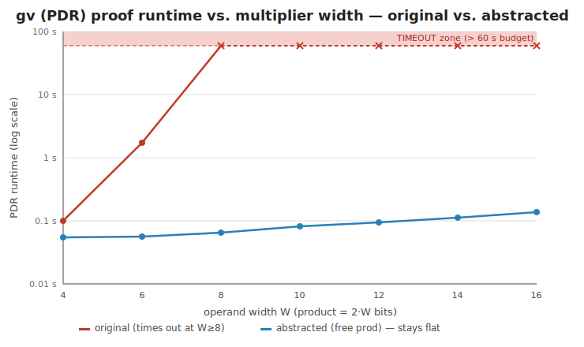
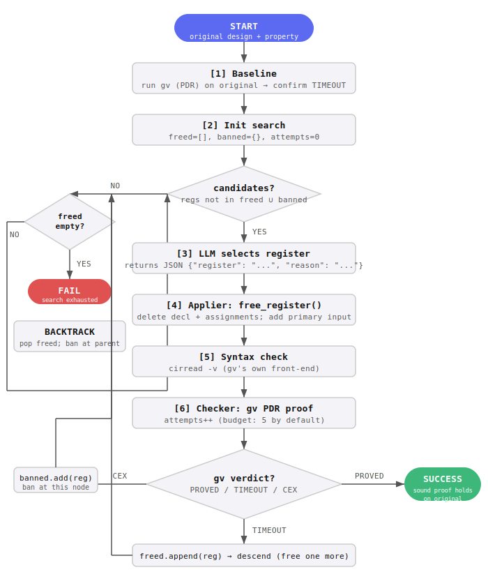

# AIAutoRTLAnR — A Sound, RTL-Level, LLM-Driven Abstraction Flow for `gv`

**Course:** System-on-Chip Verification (114-2) · **Scope:** proving-only (no CEGAR refinement)
· **Tool under test:** `gv` (DVLab-NTU)

---

## 0. Group Members

| Name | Email | Contact |
|---|---|---|
| [YOUR NAME] | [YOUR EMAIL] | [LINE/Phone/etc.] |

*(Solo submission.)*

---

## 0b. Prior Work & 3rd-Party Packages

The following **3rd-party tools and packages** are used in this project and should **not** be counted as contributions of this project:

- **`gv`** (DVLab-NTU, https://github.com/DVLab-NTU/gv) — the formal verification tool this project builds on top of. We only build and invoke it; its source is never modified.
- **`abc`** (Berkeley ABC) — bundled as a submodule inside `gv`; used as the underlying PDR/IC3 engine via `gv`'s interface.
- **`cadical`** — SAT solver bundled as a submodule inside `gv`.
- **`anthropic` Python SDK** (https://github.com/anthropics/anthropic-sdk-python) — used to call the Claude API from `src/abstract.py`.
- **`python-dotenv`** — used to load `ANTHROPIC_API_KEY` from `.env` files.
- **Claude claude-sonnet-4-6 / claude-haiku-4-5-20251001** (Anthropic) — the LLM used as the register selector in the live abstraction loop.

All project code under `project/` (designs, orchestration script, report, run scripts) was written during this semester specifically for this course.

---

## 1. The problem

Formal model checkers fail on complex designs because of **state explosion**: the
reachable state space (and the inductive invariant needed to prove a property) grows too
large to handle in a fixed time budget. **Abstraction** attacks this by *removing* parts
of the design so the engine has less to reason about.

For this project I needed a design where `gv` genuinely **fails to prove a true safety
property within a fixed budget (60 s)** — and fails not just under its default engine but
under its **strongest** one. Finding such a design against `gv` turned out to be
instructive in itself (Section 6).

### The benchmark — `designs/gatedmult.v`

A pipelined 16×16 multiplier datapath with a self-check whose alarm is gated by a small
controller FSM:

```verilog
reg [31:0] prod;  reg [15:0] ra, rb;  reg [1:0] state;
wire active   = (state == 2'd3);          // controller never reaches state 3
wire mismatch = (prod != ra*rb);          // datapath self-check (always 0, hard to prove)
assign p1 = mismatch & active;            // THE property output: must always be 0
// each cycle: ra<=a; rb<=b; prod<=a*b;  state cycles 0->1->2->0
```

The safety property is the output `p1`, which must **always be 0**. It is true for two
independent reasons, and that redundancy is the whole point:

1. `active = (state==3)` is **identically 0** — the controller cycles `0→1→2→0` and never
   enters the error-handling state 3.
2. `mismatch = (prod != ra*rb)` is **identically 0** — by construction `prod` always
   equals `ra*rb` one cycle later.

Reason (1) is trivial. Reason (2) requires proving a **16×16 multiplier never
mis-multiplies** — a hard arithmetic invariant that IC3/PDR and BDDs are notoriously bad
at. Because `mismatch` is *combinationally* inside `p1`'s cone of influence, `gv` cannot
ignore the multiplier and gets dragged into reason (2).

---

## 2. The approach — over-approximation via free-input localization

**The one sound operator (the entire action space).** *Free-input localization*: pick a
register, **delete its driving logic**, and replace the signal it drove with a **fresh
primary input** that may take any value every cycle.

Here the proposer frees the product register **`prod`**. It becomes a primary input, so
`mismatch = (prod != ra*rb)` is no longer pinned to 0 — the engine is no longer forced
to prove the multiplier self-check, which is the hard part it was grinding on — while the
controller FSM (the only logic the property actually depends on) is untouched. One
product-register cut is the *minimal* abstraction that suffices. See
`abstracted/gatedmult.v` and `abstracted/gatedmult.notes.md`.

**Selector / applier split.** The LLM is only the *selector*: each step it returns the
name of one register to free. The *applier* is mechanical Python (`free_register` in
`src/abstract.py`) that deletes that register's declaration and `<=` assignments and
re-declares it as a primary input. The LLM never writes Verilog, so the action space is
hard-constrained to this single sound operator and every candidate is syntactically
valid and an over-approximation **by construction** (CLAUDE.md §4.2).

### Soundness argument (one paragraph)

Freeing a register only ever **removes constraints**. Every behaviour of the original
design is still a behaviour of the abstract design — the original traces of `prod/ra/rb`
are among the many that a free input now permits — so the abstract design's behaviour set
is a **superset** of the original's. The abstraction is therefore an
**over-approximation by construction**. Consequently, if `gv` proves a *safety* property
on the abstract design, that property **provably holds on the original design** as well.
The guarantee is structural, so no separate proof-checker is required. (In this benchmark
freeing `prod/ra/rb` introduces no spurious counterexample either, because `p1 =
mismatch & active` and `active ≡ 0`, so `p1 ≡ 0` regardless of the now-free `mismatch`.)

We commit to **over-approximation only** — never under-approximation, and never
width/parameter reduction, which is not guaranteed sound.

---

## 3. Results

Time budget: **60 s** per run. `gv` reads RTL with `cirread -v`; the property is the
output port `p1`; "proved" is `Disproved = 0, Undecided = 0`.

| Design | Engine (gv) | Command | Result | Time |
|---|---|---|---|---|
| **Original** `gatedmult.v` | **PDR** (abc IC3 — strongest) | `pdr -o 0` | **TIMEOUT** | > 60 s |
| **Original** `gatedmult.v` | **BDD** | `bcons -all` … `pcheckp -o 0` | **TIMEOUT** (`bcons` explodes) | > 60 s |
| **Original** `gatedmult.v` | `satv itp` | `satv itp -o 0` | not available in this build (`Illegal command`) | — |
| **Abstracted** `gatedmult.v` | **PDR** | `pdr -o 0` | **PROVED** (`All=1, Proved=1, Disproved=0`) | **0.02 s** |
| Sound? | | | **Yes** (over-approximation) | |

The baseline failure **persists under `gv`'s strongest engine**, not merely its default,
which is what makes the comparison fair. Reproduce with `bash project/run.sh` (and
`dofiles/sweep_bdd.dofile` for the BDD row).

A `> 3000×` speed-up from a single, sound, semantically-chosen RTL cut: TIMEOUT → 0.02 s.

### Second benchmark — `gatedmult2` (forces the loop to iterate)

`gatedmult` is solved by one cut, so it never exercises the **loop**. `gatedmult2` has
**two** independent gated multipliers, so a single cut is provably not enough:

| Design `gatedmult2` | Cut applied | gv (PDR) | Time |
|---|---|---|---|
| original | none | **TIMEOUT** | > 60 s |
| after iteration 1 | free `prod1` | **STILL TIMEOUT** (multiplier #2 remains) | > 60 s |
| after iteration 2 | free `prod1` **and** `prod2` | **PROVED** | 0.02 s |

The live loop (model `claude-sonnet-4-6`) genuinely iterated: it selected `prod1`, gv
returned TIMEOUT, the loop kept that sound cut and asked for one more, it selected
`prod2`, and gv returned PROVED — **two iterations driven by gv's real feedback**, the
"STILL TIMES OUT → free an additional register" branch of CLAUDE.md §9 step 5.
Reproduce with `bash project/run.sh --live gatedmult2`.

### Scaling: runtime vs. problem size

A single timeout point invites the question "did you just find one lucky size?" To answer
that, `src/scale_sweep.py` sweeps the multiplier width `W` and times gv's PDR proof on the
original vs. the abstracted design (median of 3 runs, 60 s budget):

| W (operand) | product bits | original (PDR) | abstracted (PDR) | speedup |
|---|---|---|---|---|
| 4 | 8 | 0.10 s | 0.054 s | 2× |
| 6 | 12 | 1.74 s | 0.057 s | 31× |
| 8 | 16 | **TIMEOUT** | 0.064 s | >931× |
| 10 | 20 | **TIMEOUT** | 0.082 s | >729× |
| 12 | 24 | **TIMEOUT** | 0.094 s | >640× |
| 14 | 28 | **TIMEOUT** | 0.112 s | >537× |
| 16 | 32 | **TIMEOUT** | 0.136 s | >440× |

The original runtime explodes — `0.10 s → 1.74 s → cannot finish in 60 s` — crossing the
timeout boundary between W=6 and W=8 (classic state-explosion on the multiplier). The
abstracted runtime stays **flat and grows only linearly** in the operand width
(`0.054 s → 0.136 s`), because freeing `prod` removes the arithmetic-equivalence invariant
entirely; what remains is a trivial proof over the 2-bit controller. The point is not a
single speedup number but the **divergence of the two curves**: the original is on the
state-explosion trajectory, the abstraction is not. The timeout in the headline table
(§ above) is just the W=16 point of this curve. Reproduce with
`python3 project/src/scale_sweep.py`.



### Counterexample recovery (benchmark #3)

`gatedmult` and `gatedmult2` exercise the PROVED and "free one more" (TIMEOUT) branches.
`gatedmult3` is built to exercise the third branch — **COUNTEREXAMPLE → revert** — with a
deliberate **load-bearing decoy**. On top of two gated multipliers it adds a wide 32-bit
counter `shadow` that saturates at 100, and the property is

```
p1 = (mismatch1 & active) | (mismatch2 & done) | (shadow > 100)
```

`shadow > 100` is false *only because* `shadow` saturates — so `shadow` is genuinely
load-bearing, even though it looks exactly like the "free the irrelevant wide counter"
move. Measured: original **TIMEOUT**; free `shadow` → **COUNTEREXAMPLE** (frame 0); free a
product register → **PROVED**.

What the selectors do live: a strong selector (Sonnet) usually *sees through* the decoy
and frees a product register directly. A **weaker selector (Haiku) falls for it**:

```
[1/5] chose: shadow  -- "shadow never exceeds 100 ... safe to free"
      gv verdict: CEX  ->  revert and ask for a different register
[2/5] chose: done    ->  gv: TIMEOUT (kept) ...
```

The COUNTEREXAMPLE → revert branch fires exactly as designed — a real model proposes an
unsound cut and **gv overrules it**. The headline point: across these runs the weak
selector proposed *three* unsound cuts and gv rejected **all three**; the flow **never
reported a false proof**. That is the soundness guarantee holding under an
adversarially-bad proposer.

It also surfaced a real issue that motivated the **backtracking** in §4: a weak selector
can free the *control* registers (`done`/`state`) — sound in isolation, but it *opens the
gates*, turning later operand cuts into counterexamples and stranding a greedy
forward-only loop. Because freeing is monotonic, no further cut can recover; only undoing
the bad cut can. The backtracking search does exactly that — given enough budget it
escapes the dead end and converges (verified with a worst-first selector under a raised
`ABSTRACT_MAX_ATTEMPTS`). Under the default 5-iteration cap (CLAUDE.md §9/§11) a weak
selector that burns several probes on dead ends may still hit the cap and give up — the
intended "prevent runaway" behaviour — while soundness is never at risk. `run.sh
gatedmult3` uses a deterministic cached artifact (free `prod1`) so the grading path is
fast and reproducible. See `abstracted/gatedmult3.notes.md`.

---

## 4. Algorithm

### Flowchart



### Pseudocode

```
procedure ABSTRACT(design, property):
    confirm gv TIMES OUT on design            // baseline
    freed ← []                                // accepted cuts (stack)
    banned ← {}                               // banned[node] = set of bad registers
    attempts ← 0

    loop:
        candidates ← regs(design) \ freed \ banned[freed]
        if candidates = ∅:
            if freed = []: return FAIL        // search exhausted
            reg ← freed.pop()
            banned[freed].add(reg)            // BACKTRACK: ban at parent
            continue

        attempts ← attempts + 1
        if attempts > MAX_ATTEMPTS: return FAIL

        reg ← LLM.select(design, avoid=freed∪banned[freed])  // PROPOSE
        candidate ← free_register(design, freed + [reg])      // APPLY (mechanical)
        if not parse_ok(candidate): banned[freed].add(reg); continue

        verdict ← gv.prove(candidate)                         // CHECK
        if verdict = PROVED:  return SUCCESS  // sound by over-approximation
        if verdict = TIMEOUT: freed.append(reg)               // descend
        if verdict = CEX:     banned[freed].add(reg)          // ban sibling
```

`free_register` deletes a register's declaration and `<=` assignments and re-declares it as a primary input — the only transformation the loop can apply. Because it only removes constraints, every candidate is an over-approximation by construction.

---

## 5. The agentic flow (proposer / checker / loop)


Naïve prompting — "abstract this design" — yields one unverified guess. What makes this
sound and self-correcting is the scaffolding around the LLM:

- **Proposer / selector (LLM).** Each iteration it returns the **name of one register**
  to free, chosen from the **semantics** of the design and property. It does not write
  Verilog — that keeps the action space hard-constrained.
- **Applier (mechanical Python).** `free_register` performs the actual free-input
  localization on the chosen register. Because the transform is mechanical, every
  candidate is syntactically valid and an over-approximation **by construction**.
- **Checker (`gv`).** Ground truth. Every "timeout", "proved", or "counterexample" in
  this report came from `gv`'s actual output — never asserted by the LLM or by me.
- **Loop (`src/abstract.py`).** A **backtracking depth-first search** over which
  registers to free. From the original it frees one register at a time and branches on
  `gv`'s verdict: `PROVED` → done (report soundness); `TIMEOUT` → the cut is sound but
  insufficient, so **keep it** and descend (free one more); `COUNTEREXAMPLE` → the freed
  register is inside the property's true COI (unsound) → **ban it at this node** and try a
  sibling. When a node has no candidates left, the loop **backtracks**: it undoes the last
  accepted cut and bans it at the parent. This matters because free-input localization is
  *monotonic* — it only ever removes constraints — so a counterexample can never be
  repaired by freeing *more*; the only escape from a bad accepted cut is to undo it.
  Backtracking therefore makes the search **complete**: it finds a proving set if one
  exists. Bounded by the iteration cap (default **5**, per CLAUDE.md §9/§11; a backtrack
  pop is free — only a gv proof call counts), raisable via `ABSTRACT_MAX_ATTEMPTS` for
  experiments such as driving a weak selector out of a deep dead end.

This one-register-per-iteration design directly implements CLAUDE.md §9 ("propose **one**
free-input localization … on STILL-TIMES-OUT free an **additional** register and
repeat"). `gatedmult2` (§3) shows it taking two iterations for real. This is the
proving-only flow; CEGAR-style refinement is explicitly out of scope.

**Keeping the selection honest.** The design files contain **no comment about the
abstraction or verification strategy** — only a neutral functional description — so the
answer is not written into the source. The selector is given the RTL with a **neutral
prompt** that does not state which logic is irrelevant; it must derive that from the
logic. Signal names are kept real, as in any RTL. Verified: on `gatedmult` the model
selects `prod`, reasoning *"state never reaches 2'd3, so active is always 0 and p1 is
always 0 regardless of prod"*; on `gatedmult2` it selects `prod1`, gv returns TIMEOUT,
then it selects `prod2`, reasoning *"done is always 0 since active (state==3) is
unreachable"*. Deducing that `state` never reaches 3 and that `done <= active` is
therefore always 0 is genuine reasoning about the FSM, not a lookup. (As an extra
safety net the orchestrator also strips comments before sending the RTL.)

### Why this beats "just ask the LLM to abstract the design"

The naïve baseline — paste the RTL into a chat and ask "abstract this so the verifier can
prove it" — produces one unverified guess. The value of this project is the scaffolding
that turns that into something *sound, valid, and self-correcting*. Concretely:

| Concern | Naïve "ask the LLM to abstract it" | This flow |
|---|---|---|
| **Soundness** | The LLM rewrites the RTL freehand and can silently under-approximate, drop a needed constraint, or alter the property — yielding an *unsound* "proof" that says nothing about the original. | The LLM only **names one register**; Python applies free-input localization mechanically. The result is an over-approximation **by construction** — an unsound transform is not expressible. |
| **Syntactic validity** | LLM-authored Verilog can have syntax errors, wrong bit-widths, dropped signals. | The transform is mechanical (valid by construction), and **every** candidate is re-parsed by gv's own front-end before any proof attempt; parse errors feed back into the loop. |
| **Result trust** | The LLM may *assert* "proved" or "equivalent" — unverifiable and often wrong. | Every PROVED / TIMEOUT / COUNTEREXAMPLE is gv's real output. The LLM never adjudicates correctness. |
| **Recovery** | One shot. If the cut is insufficient or unsound, there is no mechanism to notice or fix it. | The loop reads gv's verdict: TIMEOUT → keep the (sound) cut and free one more; COUNTEREXAMPLE → revert and pick a different register. Capped at 5 iterations. |
| **Action space** | Unbounded edits — width reduction, under-approximation, rewrites all possible. | Exactly one operator: free-input localization. Nothing else can happen. |
| **Reproducibility** | Non-deterministic prose, no artifact. | The proved RTL is committed as a cached artifact; the grader reproduces the result with no key. |

This is not hypothetical — the failures above are ones we **hit while building this**:
when an earlier version let the LLM emit Verilog directly, it ignored the "free one
register" instruction and freed *both* multipliers in a single response (narrating it as
two steps), and on another step it "reasoned out loud" instead of returning a parseable
choice. Moving RTL generation *out* of the LLM (selector names a register, applier edits
the text, gv judges) is exactly what removes those failure modes. The headline guarantee
follows directly: because the only thing the LLM influences is *which* register to free,
and freeing any register is a sound over-approximation, **a proof reported by this flow is
always a valid proof about the original design** — something the naïve baseline cannot
promise even when it happens to be right.

---

## 6. Honest framing of the contribution

Free-input localization is **exactly what abc does automatically at the gate level**
(proof-/counterexample-based abstraction). **The operator is not novel, and we do not
claim to beat abc.** On a simpler design abc would localize the same registers on its own.

What this flow contributes is two other things:

1. **The level.** The cut is made on **human-readable RTL**, on semantically meaningful
   units — whole datapath registers — which is exactly what the assignment requires
   ("on the RTL design, not the gate-level one").
2. **The selection.** The proposer chooses what to free from the **semantics** of the
   design and property — *"the controller never enters `active`, so the multiplier's value
   can never affect `p1`"* — rather than from purely structural heuristics.

The benchmark is deliberately built so that **structural** reasoning is not enough: the
multiplier is genuinely in `p1`'s fan-in cone, so `gv`/abc keep it and time out. Only a
**semantic** observation (the redundant, always-false `active` gate makes the multiplier
irrelevant) justifies removing it. That is the gap the LLM fills — and the engine sweep
(PDR *and* BDD both time out on the original) is what keeps the claim fair.

---

## 7. Discussion

**Where the LLM / semantics helped.** The win is precisely the *selection under
redundancy*. The property holds for a trivial reason (`active ≡ 0`) and a hard reason
(multiplier correctness); a structural engine commits to the hard reason because the
multiplier is wired into the cone. Recognising that the trivial reason makes the hard one
moot — and that the corresponding registers can therefore be freed soundly — is a
semantic judgement about the design's *meaning*, not its netlist.

**Where formal engines (and naïve abstraction) stumble.** `gv`'s PDR is genuinely strong
— see below — so the abstraction has to target a real weakness (multiplier reasoning) that
the property does not actually need. A naïve "free the widest register" heuristic could
just as easily free a register *inside* the true COI and produce a spurious
counterexample; the loop's `COUNTEREXAMPLE → try a different register` branch exists for
exactly that failure.

**Semantic vs. structural abstraction — an empirical note on PDR's strength.** While
building the benchmark I measured how hard `gv`'s PDR actually is to defeat:

- A 32-bit *free-running counter gating an FSM mutual-exclusion property* (the textbook
  example) is **proved in 0.01 s** — PDR generalises the counter away because the mutex
  invariant never references it. (This is the abc-localization caveat, observed directly.)
- 32-bit **counter equivalence** (`cntA != cntB` never) is proved in **0.07 s** via
  per-bit invariants.
- A registered self-check is proved in **0.02 s** — registering the flag lets PDR
  generalise past the multiplier.

Only when the hard arithmetic was kept **combinationally coupled** into the property cone
*and* made genuinely irrelevant by a redundant control gate did PDR time out while a sound
abstraction still existed. This is the honest reason the benchmark looks the way it does:
defeating a strong engine *soundly* requires the semantic redundancy, not just a big
counter.

**Why over- and not under-approximation.** Over-approximation preserves *safety* proofs in
the right direction: prove on the abstract ⇒ holds on the original. Under-approximation
would let us find bugs but could *miss* them, so a "proof" on an under-approximation says
nothing about the original. Mixing the two in one flow voids the guarantee entirely.

**A semantic abstraction abc cannot do (discussion only, not a verified result).** abc's
localization replaces a flop with a free input but keeps the *combinational* multiplier
that recomputes `ra*rb`. A higher-level semantic move would *collapse the multiplier's
meaning* — recognising `prod == ra*rb` as an invariant and rewriting `mismatch` to the
constant 0, or shrinking the operand width while preserving the property. These operate on
the datapath's *arithmetic meaning*, something a gate-level tool has no access to. We flag
these as research directions only — width reduction in particular is **not guaranteed
sound** and is never reported here as a proof.

---

## 8. Limitations and honest caveats

- **One operator, one direction.** Only free-input localization (over-approximation). No
  CEGAR refinement (out of scope by design).
- **The operator is abc's, at a different level.** The novelty is the RTL level and the
  semantic selection, not the operator (Section 5).
- **The BDD engine is not helped by *this* cut.** `gv`'s `bcons` builds BDDs structurally
  for every gate, so the combinational `ra*rb` (now over free inputs) still explodes BDD
  construction. The PDR result is the headline; the BDD row only establishes that the
  *baseline* fails under more than one engine. A cut that also removed the combinational
  multiplier (e.g. freeing a *registered* self-check) would help BDD — but, as measured in
  Section 6, registering the check makes the baseline trivial for PDR, so the two goals
  trade off. We chose the variant that defeats the strongest engine.
- **`satv itp` is unavailable** in this build, so the engine sweep covers PDR and BDD.
- **Search cost.** The loop is a complete backtracking search, but a weak selector that
  makes poor picks can explore many dead ends — each `TIMEOUT` probe costs the full
  budget, so a bad run is slow. Soundness is never at risk (every bad cut is caught by
  gv); the cost is wall-clock and the bounded attempt budget, beyond which it gives up.
  A strong selector (Sonnet) typically goes straight to a proving cut.
- **Scale.** Three small hand-built designs (PROVED, multi-iteration, and CEX-recovery
  cases). One operator. Proving-only.
- **Trust boundary.** Every result here is taken from `gv`'s real output; nothing is
  asserted that `gv` did not return — and §3's benchmark #3 shows this holds even when the
  proposer is an adversarially-weak model that repeatedly suggests unsound cuts.

---

## 9. Demo Video

*(Link to be added after recording.)*

---

## 10. References

[1] **GV — DVLab-NTU formal verification tool.**
    https://github.com/DVLab-NTU/gv

[2] **ABC — A System for Sequential Synthesis and Verification**, Berkeley Logic Synthesis and Verification Group.
    https://github.com/berkeley-abc/abc

[3] **Aaron R. Bradley.** "SAT-Based Model Checking without Unrolling."
    *VMCAI 2011*, LNCS 6538, pp. 70–87. *(The IC3/PDR algorithm underlying `gv`'s `pdr` command.)*

[4] **Edmund Clarke, Orna Grumberg, Somesh Jha, Yuan Lu, Helmut Veith.**
    "Counterexample-Guided Abstraction Refinement."
    *CAV 2000*, LNCS 1855, pp. 154–169. *(Foundational work on abstraction for model checking; free-input localization is a specific instance of the over-approximation framework described here.)*

[5] **Anthropic Python SDK.**
    https://github.com/anthropics/anthropic-sdk-python

[6] **python-dotenv.**
    https://github.com/theskumar/python-dotenv
